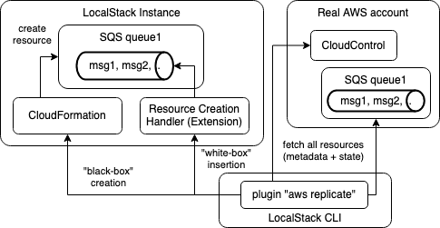

AWS Replicator Extension (experimental)
========================================

A LocalStack extension to replicate AWS resources into your local machine.

⚠️ Please note that this extension is experimental and currently under active development.

## Overview

The figure below illustrates how the extension can be used to replicate the state, e.g., an SQS queue and the messages contained in it, from AWS into your LocalStack instance.



## Installing

To install the CLI extension, use the following `pip` command:
```bash
pip install "git+https://github.com/localstack/localstack-extensions/#egg=localstack-extension-aws-replicator&subdirectory=aws-replicator"
```

To install the extension itself (server component running inside LocalStack), use the following `extensions` command:
```bash
localstack extensions install "git+https://github.com/localstack/localstack-extensions/#egg=localstack-extension-aws-replicator&subdirectory=aws-replicator"
```

## Usage

To use the extension, make sure that you have access to AWS configured in your terminal. Note: the extension will only talk to AWS in read-only mode, and will **not** make any changes to your real AWS account.

The following command can be used to replicate SQS queues (incl. their messages) into your LocalStack instance:
```
$ localstack aws replicate -s sqs
```

Once the command has completed, you should be able to list and interact with the queue that was replicated into your local account:
```
$ awslocal sqs list-queues
...
$ awslocal sqs receive-message --queue-url ...
...
```

## License

This extension is published under the Apache License, Version 2.0.
By using it, you also agree to the LocalStack [End-User License Agreement (EULA)](https://github.com/localstack/localstack/tree/master/doc/end_user_license_agreement).